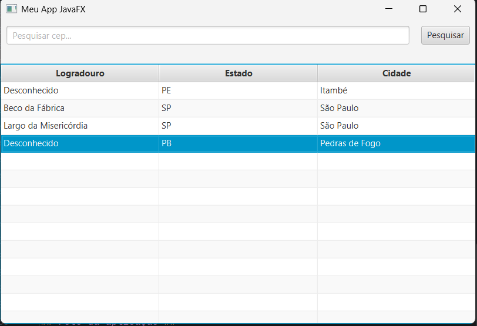
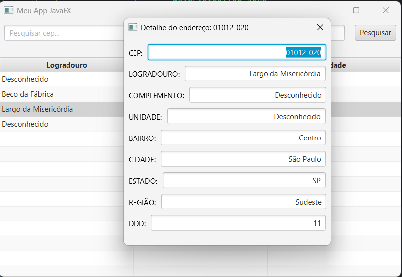

# 🚀 Projeto: Busca de CEP

---

<p>
Este projeto foi desenvolvido para aplicar conhecimentos em Java, incluindo Orientação a Objetos, consumo de APIs via HttpClient e manipulação de arquivos. Também foram aplicados conceitos avançados, como JavaFX para interface gráfica, Live Binding para atualização automática da UI e cache para evitar requisições repetidas à mesma entrada.
</p>

## ⚙️ Tecnologias utilizadas

   

* Java 17.0.8
* JavaFX 17.0.8
* Maven
* Gson

## 🗂 Estrutura do projeto

```
├───main
│   ├───java
│   │   └───dev/swell/cotacao
│   │       │   AppGson.java
│   │       │   MainApp.java
│   │       ├───api
│   │       │   │   Cache.java
│   │       │   │   ViaCepAPI.java
│   │       │   └───adapter
│   │       │           ApiViaCepGsonEmptyStringAdapter.java
│   │       ├───controller
│   │       │       AddressDetailController.java
│   │       │       MainController.java
│   │       ├───model
│   │       │       AddressData.java
│   │       │       AddressMapper.java
│   │       │       AddressModel.java
│   │       └───viewmodel
│   │               AddressDetailViewModel.java
│   │               AddressViewModel.java
│   └───resources/views
│           address-detail-view.fxml
│           main-view.fxml
└───test
```

## 📌 Descrição das responsabilidades

* **AppGson**: Instância global do Gson com configurações personalizadas.
* **Cache**: Gerencia o sistema de cache para consultas mais rápidas.
* **ViaCepAPI**: Busca dados na API do ViaCEP.
* **ApiViaCepGsonEmptyStringAdapter**: Trata Strings vazias como "Desconhecido" no Gson.
* **AddressDetailController**: Exibe detalhes do endereço.
* **MainController**: Controller principal da aplicação.
* **AddressData**: Estrutura de dados recebida da API.
* **AddressMapper**: Converte o DTO da API para a classe Model.
* **AddressModel**: Model compatível com JavaFX para Live Binding.
* **AddressDetailViewModel**: ViewModel responsável pelos detalhes do endereço.
* **AddressViewModel**: ViewModel da tela principal.
* **address-detail-view.fxml**: Layout da tela de detalhes.
* **main-view.fxml**: Layout da tela principal.

## 📷 Capturas da aplicação



<p>Tela principal exibindo alguns dados na tabela.</p>



<p>Tela de detalhes do endereço.</p>

## 🔗 Links úteis

* [ViaCEP API](https://viacep.com.br/)
* [Documentação JavaFX](https://openjfx.io/)
* [Maven](https://maven.apache.org/)
* [Gson](https://github.com/google/gson)
